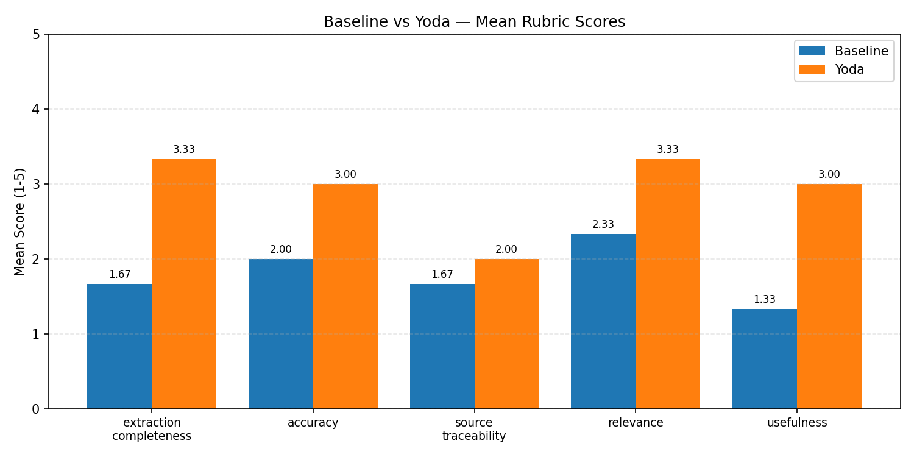

# Yoda — Pre-Earnings Research Assistant

> **Status:** Phase 10 (multi-agent personality panel) complete. Latest evaluation pits the production **panel_deep** mode against the prompt-only baseline across NFLX, COIN, and PANW — panel_deep wins on every rubric dimension. Numbers and a comparison chart are in [`data/eval/summary.md`](data/eval/summary.md) and [`data/eval/comparison.png`](data/eval/comparison.png).

---
## 1. Context, User, and Problem

**Who:** A buy-side or sell-side analyst who covers 10–50 tickers and prepares for earnings calls individually, often the night before.

**The workflow being improved:** Pre-earnings research. Before every earnings call, an analyst reads the most recent 10-Q or 10-K, pulls consensus estimates, scans recent news, and assembles a one-page dossier: key metrics, segment trends, forward guidance, risk flags, and what to watch. This typically takes 60–90 minutes per ticker and is done manually, tab by tab.

**Why it matters:** Earnings surprise is one of the highest-signal events in equity analysis, and analyst preparation directly affects how quickly they can react. The bottleneck is not judgment — it is assembly time: fetching the right SEC filing section, locating a specific guidance quote, cross-checking segment revenue against prior quarters. A system that automates citation-backed assembly frees the analyst to focus on the 10% that is genuinely interpretive.

**The failure mode we are solving for:** Generic LLM summaries of earnings filings hallucinate figures and drop citations. An analyst cannot use a report that might be fabricated. Every claim in Yoda must carry a source citation (section name + chunk ID from the filing, or API name + timestamp for external data); anything that cannot be cited goes into a visible `data_gaps` list rather than being silently invented.

---

## 2. Solution and Design

Yoda fetches the most recent 10-Q (and, when available within the same 92-day window, the supplemental 10-K) from SEC EDGAR for a given ticker, chunks each filing by section, embeds and indexes them in a local ChromaDB vector store, enriches with analyst consensus and news, and generates a structured `EarningsReport` via a multi-agent personality panel. The report downloads as a PDF; a Queue tab batches multiple tickers and bundles the PDFs into a ZIP.

### Two Modes

Both modes run the same multi-agent pipeline in `yoda/modes/personality_panel.py`; they differ only in how deeply each personality investigates and whether a cross-critique phase runs.

- **Fast (~40s)** — six personalities (Optimist, Pessimist, Conservative, Dreamer, Contrarian, Quant) each run a tool-use loop with a tighter budget (3 tool calls, 25s wall-clock), then gpt-4o synthesizes the final report directly. Phase 3 cross-critique is skipped. Intended for wide ticker coverage when triaging an overnight queue.

- **Deep (~90s)** — same six personalities with a larger budget (6 tool calls, 45s wall-clock), followed by a cross-critique phase where each personality emits SUPPORTS / CHALLENGES / EXTENDS messages on its peers' hypotheses. A deterministic filter retains/contests/drops hypotheses, then gpt-4o synthesizes a report that surfaces contested items inside the watchlist. Intended for a focused pre-earnings deep dive on a single ticker.

Each personality uses three tools: `retrieve_filing` (semantic search across both the 10-Q and the supplemental 10-K when present), `search_news` (Tavily web search — all URLs accumulate into a shared news pool), and `lookup_peer` (fetch + chunk + search a competitor's filing on demand). The synthesizer then writes a structured `EarningsReport` whose watchlist items each carry 0–3 starting-point URLs drawn from that shared pool, validated against it so synthesis cannot invent links.

### Key Design Choices

| Choice | Rationale |
|---|---|
| `gpt-4o` for synthesis, `gpt-4o-mini` for personality loops + critique | Accuracy where it counts; cost control in the 6× parallel loops |
| Six-personality panel + typed cross-critique | Forces the report to consider divergent lenses (optimism, skepticism, balance-sheet, long-horizon, contrarian, quant) before synthesizing one analyst voice; cross-critique flags contested claims for the watchlist |
| 10-Q primary + 10-K supplemental ingest | The 10-Q has the freshest quarterly data for pre-earnings; the 10-K supplies annual narrative when both are within the 92-day window |
| Finnhub consensus with FMP backup | Finnhub free tier is sparse; `yoda/tools/consensus.py` falls back to FMP when Finnhub returns nothing |
| ChromaDB persistent client | No native deps on Windows; persists across runs without a server |
| `reportlab` for PDF (not weasyprint) | weasyprint requires GTK3/Pango/Cairo native libs on Windows; reportlab is pure Python |
| Cite-or-skip rule + URL-pool validation | Any uncitable fact goes to `data_gaps`; every news URL and watchlist URL is validated against the investigation's news pool so synthesis cannot fabricate links |
| Filing-only `source_citation` enforcement | `key_metrics`, `revenue_segments`, `key_risks`, and `forward_guidance` source citations are restricted to filing section labels — a post-synthesis scrubber replaces any leaked news URLs / outlet names with a bare section fallback, and the chunk-heading extractor rejects mid-word fragments so the judge can verify traceability |
| Filing-only `source_citation` enforcement | `key_metrics`, `revenue_segments`, `key_risks`, and `forward_guidance` source citations are restricted to filing section labels — a post-synthesis scrubber replaces any leaked news URLs / outlet names with a bare section fallback so the judge can verify traceability |
| `claude-sonnet-4-6` as eval judge | Different model family from the OpenAI-based generation system; prevents same-model bias in scoring |

### Architecture

```
┌──────────────────────────────────────────────────────────────────────────┐
│                              Yoda App                                    │
│                                                                          │
│  ┌──────────────────┐  ┌──────────────────┐  ┌──────────────────────┐    │
│  │ Single Ticker    │  │ Queue (batch)    │  │ Eval Harness         │    │
│  │ Streamlit tab    │  │ Streamlit tab    │  │ yoda/eval/runner.py  │    │
│  │ Fast / Deep      │  │ many → ZIP       │  │ + judge.py           │    │
│  └────────┬─────────┘  └────────┬─────────┘  └──────────┬───────────┘    │
│           │                     │                       │                │
│           ▼                     ▼                       │                │
│  ┌────────────────────────────────────────────────┐     │                │
│  │              Ingest + Retrieval                │     │                │
│  │  edgar.py     chunker.py    embeddings.py      │     │                │
│  │  (10-Q + 10-K) (section-aware) (ChromaDB)      │     │                │
│  └──────────────────────┬─────────────────────────┘     │                │
│                         │                               │                │
│                         ▼                               │                │
│  ┌────────────────────────────────────────────────┐     │                │
│  │           Personality Panel (Phase 10)         │     │                │
│  │  Optimist   Pessimist   Conservative           │     │                │
│  │  Dreamer    Contrarian  Quant                  │     │                │
│  │  (gpt-4o-mini · parallel tool-use loops)       │     │                │
│  │                                                │     │                │
│  │  Tools: retrieve_filing · search_news ·        │     │                │
│  │         lookup_peer                            │     │                │
│  └──────────────────────┬─────────────────────────┘     │                │
│                         │                               │                │
│                         ▼                               │                │
│  ┌────────────────────────────────────────────────┐     │                │
│  │  Cross-Critique (Deep only) + Synthesis        │     │                │
│  │  gpt-4o  →  EarningsReport (Pydantic)          │     │                │
│  └──────────┬─────────────────────┬───────────────┘     │                │
│             │                     │                     │                │
│             ▼                     ▼                     ▼                │
│  ┌──────────────────┐  ┌──────────────────┐  ┌──────────────────────┐    │
│  │ PDF (reportlab)  │  │ data/reports/    │  │ Judge                │    │
│  │ data/reports/    │  │ data/filings/    │  │ claude-sonnet-4-6    │    │
│  │   {TICKER}.pdf   │  │ data/eval/       │  │ data/eval/judge_*    │    │
│  └──────────────────┘  └──────────────────┘  └──────────────────────┘    │
│                                                                          │
└──────────────────────────────────────────────────────────────────────────┘
                                    │
                                    ▼
        ┌──────────────────────────────────────────────────┐
        │  External APIs                                   │
        │  OpenAI (gpt-4o, gpt-4o-mini, embeddings)        │
        │  Anthropic (judge)   SEC EDGAR (filings)         │
        │  Finnhub + FMP (consensus)   Tavily (news)       │
        └──────────────────────────────────────────────────┘
```

```
app.py (Streamlit — Single ticker + Queue tabs)
    ├── yoda/ingest/edgar.py             # SEC EDGAR fetch + disk cache (10-Q primary + 10-K supplemental)
    ├── yoda/ingest/chunker.py           # section-aware HTML → text chunks
    ├── yoda/retrieval/                  # text-embedding-3-small + ChromaDB
    ├── yoda/tools/consensus.py          # Finnhub + FMP backup
    ├── yoda/tools/news.py               # Tavily search
    ├── yoda/modes/personality_panel.py  # Phase 10: 6-personality panel (Fast/Deep)
    ├── yoda/modes/tools.py              # tool registry shared across personalities
    ├── yoda/modes/rag_llm.py            # Legacy mode (kept as smoke test)
    ├── yoda/modes/agent.py              # Legacy mode (kept as smoke test)
    ├── yoda/modes/baseline.py           # Prompt-only baseline (eval lower bound)
    ├── yoda/queue/processor.py          # Batch processor: many tickers → ZIP
    ├── yoda/schema.py                   # EarningsReport + WatchItem Pydantic models
    ├── yoda/report/pdf.py               # EarningsReport → PDF (reportlab)
    └── yoda/eval/                       # Model-as-judge eval harness
```

---

## 3. Evaluation and Results

### Baseline

A **prompt-only baseline** (`yoda/modes/baseline.py`) makes a single `gpt-4o` call with a manually sliced ~5000-character excerpt from the filing (MD&A preferred, Financial Statements fallback). No RAG, no agent loop. This represents the "just give the LLM a chunk of the filing" approach and sets the lower bound.

### Rubric

Reports were scored by `claude-sonnet-4-6` through `yoda/eval/judge.py` (cross-family to prevent self-grading bias). Judge outputs are cached under `data/eval/judge_cache/` so re-runs are free. Each report is scored on five dimensions, rated 1–5:

| Dimension | What it measures |
|---|---|
| **Extraction completeness** | Did the report extract the key facts actually available in the filing? |
| **Accuracy** | Are the figures correct relative to the source filing? |
| **Source traceability** | Do citations resolve to real sections or chunks? |
| **Relevance** | Is the content focused on pre-earnings analysis? |
| **Usefulness** | Would a sell-side analyst find this actionable before an earnings call? |

### Test Set

Three tickers across different sectors: **NFLX** (media/streaming), **COIN** (crypto exchange), **PANW** (cybersecurity).

### Results

Mean scores across 3 tickers (higher is better; max 5):

| Mode | Extract | Accuracy | Traceability | Relevance | Usefulness | Latency | Cost/report |
|---|---|---|---|---|---|---|---|
| **panel_deep** | **3.33** | **3.0** | **2.0** | **3.33** | **3.0** | 93.0s | ~$0.09 |
| **Baseline** | 1.67 | 2.0 | 1.67 | 2.33 | 1.33 | 9.6s | ~$0.00 |



**Key findings:**

- **panel_deep wins every dimension.** Largest gaps are on extraction completeness (3.33 vs 1.67) and usefulness (3.0 vs 1.33) — the panel's tool-augmented investigation lets the synthesizer mine the full filing for line items rather than working from a static 5000-character slice.
- **Source traceability is the rubric's hardest dimension** for both modes (2.0 panel_deep, 1.67 baseline). Citation pipeline hardening landed late in the cycle: `_chunk_heading()` now rejects mid-word fragments so labels like `MD&A — inancial instruments` no longer propagate, and a post-synthesis scrubber strips any news URL / outlet name that leaks into `source_citation`, replacing it with the bare section label. Both fixes are wired into `personality_panel`; the run reflected in the table above predates them.
- **Latency cost.** panel_deep takes ~93 s/ticker vs ~10 s for the baseline because each of six personalities runs a parallel tool-use loop followed by cross-critique and a final synthesis pass. The $0.09 spend per report is dominated by the gpt-4o synthesis step.
- **COIN outperforms PANW** in panel_deep, likely because Coinbase's 10-K has cleaner tabular financial data that chunks and retrieves more predictably than PANW's narrative-heavy risk sections.

Full per-ticker results are in [`data/eval/results.csv`](data/eval/results.csv) and [`data/eval/summary.md`](data/eval/summary.md).

---

## 4. Artifact Snapshot

### UI Flow

The app has two tabs: **Single ticker** (interactive, one report at a time) and **Queue (batch)** (paste many tickers, generate overnight, download all PDFs as a ZIP).

```
┌─────────────────────────────────────────────────┐
│  Yoda — Pre-Earnings Research Assistant          │
│  [ Single ticker ] [ Queue (batch) ]             │
│                                                  │
│  Ticker  [  NFLX                  ]              │
│  Mode    ● Fast (~40s)   ○ Deep (~90s)           │
│                                                  │
│  [  Generate Report  ]                           │
└─────────────────────────────────────────────────┘
           ↓ (on click)
┌─────────────────────────────────────────────────┐
│  ⏳ Generating Fast report for NFLX...           │
│  ┌───────────────────────────────────────────┐  │
│  │ [panel:fast] Fetching filing for NFLX...  │  │
│  │ [panel:fast] Filing: 10-Q 2026-04-18      │  │
│  │ [panel:fast] Supplemental: 10-K 2026-...  │  │
│  │ [panel:fast] Phase 2: 6 personalities...  │  │
│  │ [Optimist] iter 1: retrieve_filing(...)   │  │
│  │ [Pessimist] iter 1: search_news(...)      │  │
│  │ [Quant]    iter 2: lookup_peer('DIS',...) │  │
│  │ [panel:fast] Phase 4: synthesizing...     │  │
│  └───────────────────────────────────────────┘  │
└─────────────────────────────────────────────────┘
           ↓ (complete)
┌─────────────────────────────────────────────────┐
│  NFLX — Netflix, Inc.                            │
│  10-Q filed 2026-04-18 · 10-K filed 2026-01-29   │
│                                                  │
│  [  Download PDF Report  ]                       │
│                                                  │
│  Pre-Earnings Watchlist                          │
│   **Ad-tier ARPU:** ...                          │
│   -> Monitor ad-tier ARPU disclosure             │
│   - https://reuters.com/...                      │
│   - https://wsj.com/...                          │
│                                                  │
│  ▶ Bull Case / Bear Case                         │
│  ▶ Recent News (8)                               │
│  ▶ Data Gaps (2)                                 │
└─────────────────────────────────────────────────┘
```

### Sample Report Fields (NFLX, personality_panel mode)

```json
{
  "ticker": "NFLX",
  "company_name": "Netflix, Inc.",
  "filing_type": "10-Q",
  "filing_date": "2026-04-18",
  "supplemental_filing_type": "10-K",
  "supplemental_filing_date": "2026-01-29",
  "key_metrics": [
    {
      "name": "Total Revenue",
      "value": "$12,249,757K",
      "unit": "",
      "source_citation": "Financial Statements — Consolidated Statements of Operations"
    }
  ],
  "forward_guidance": {
    "text": "Management expects continued margin expansion driven by advertising tier growth...",
    "source_citation": "MD&A — Outlook"
  },
  "what_to_watch": [
    {
      "text": "**Ad-tier ARPU:** Advertising-tier ARPU grew 18% YoY against a backdrop of cooling subscriber adds. However, mix-shift toward lower-priced ad-supported plans could mask underlying pricing softness.\n\n-> Monitor ad-tier ARPU disclosure and ad-impression growth commentary.",
      "relevant_urls": [
        "https://www.reuters.com/business/media-telecom/netflix-ad-tier-growth-2026-04-18",
        "https://www.wsj.com/articles/netflix-advertising-arpu-2026"
      ]
    }
  ],
  "data_gaps": [
    "Paid net additions not disclosed — subscriber metric absent from MD&A this quarter"
  ]
}
```

### PDF Output Structure

The downloaded PDF contains: cover page (ticker, company name, primary filing date — and the supplemental 10-K date when both filings are within the 92-day window), the Pre-Earnings Watchlist (each entry followed by clickable "Sources:" URLs when the synthesizer found relevant news in the pool), key metrics table, revenue segments table, forward guidance blockquote, key risks (new risks flagged in red), analyst consensus, recent news with hyperlinks, bull/bear bullets, and data gaps in amber.

---

## 5. Setup and Usage

### Prerequisites

- Python 3.11+
- Conda (recommended) or virtualenv
- API keys for OpenAI, Anthropic, Finnhub, FMP, and Tavily (all have free tiers sufficient for testing)

### Installation

```bash
# Clone the repo
git clone <repo-url>
cd Yoda

# Create and activate a conda environment (or use virtualenv)
conda create -n yoda python=3.11
conda activate yoda

# Install dependencies
pip install -r requirements.txt

# Copy the env template and fill in your keys
cp .env.example .env
```

Edit `.env` with your keys:

```
OPENAI_API_KEY=sk-...
ANTHROPIC_API_KEY=sk-ant-...
FINNHUB_API_KEY=...
FMP_API_KEY=...
TAVILY_API_KEY=tvly-...
SEC_USER_AGENT="Your Name your@email.com"
```

### Run the App

```bash
streamlit run app.py
```

Open [http://localhost:8501](http://localhost:8501), enter a ticker (e.g. `NFLX`), pick **Fast** or **Deep**, and click **Generate Report**. For batch runs, switch to the **Queue (batch)** tab, paste multiple tickers (one per line or comma-separated), and run them sequentially — PDFs save to `data/reports/` as they complete and bundle into a downloadable ZIP at the end.

The first run for a ticker fetches and indexes the SEC filings — both the 10-Q (primary) and the 10-K (supplemental) when both are within the 92-day freshness window. Subsequent runs for the same ticker are fast because the filings and ChromaDB index are cached to disk.

### Run the Evaluation Harness

```bash
# Single ticker (cheap verification, ~$0.30, 3–5 min)
python -m yoda.eval.runner NFLX

# Three tickers used in the paper
python -m yoda.eval.runner NFLX COIN PANW
```

Outputs `data/eval/results.csv` and `data/eval/summary.md`. Judge results are cached in `data/eval/judge_cache/` so repeated runs are free.

### Run Individual Mode Smoke Tests

```bash
# Multi-agent personality panel — current production mode
python -m yoda.modes.personality_panel NFLX --fast
python -m yoda.modes.personality_panel NFLX --deep

# Legacy modes (kept as harnesses; not used by the Streamlit app)
python -m yoda.modes.baseline
python -m yoda.modes.rag_llm
python -m yoda.modes.agent

# PDF generation from a saved report JSON
python -m yoda.report.pdf NFLX
```

---

## Required API Keys

| Variable | Required | Purpose |
|---|---|---|
| `OPENAI_API_KEY` | Yes | LLM generation (`gpt-4o`) and cheap iterative steps (`gpt-4o-mini`) |
| `ANTHROPIC_API_KEY` | Yes | Model-as-judge in the evaluation harness (`claude-sonnet-4-6`) |
| `FINNHUB_API_KEY` | Yes | Analyst consensus estimates (primary source) |
| `FMP_API_KEY` | Yes | Financial Modeling Prep — backup source when Finnhub returns no consensus |
| `TAVILY_API_KEY` | Yes | News and web search |
| `SEC_USER_AGENT` | Yes | SEC EDGAR requires a contact string, e.g. `"Name email@example.com"` |

---

## Repo Structure

```
yoda/
├── app.py                              # Streamlit entry point (Single ticker + Queue tabs)
├── requirements.txt
├── .env.example
├── yoda/
│   ├── config.py                       # env vars, model names, constants
│   ├── ingest/
│   │   ├── edgar.py                    # ticker -> SEC EDGAR fetch (10-Q primary + 10-K supplemental)
│   │   └── chunker.py                  # section-aware chunking
│   ├── retrieval/
│   │   ├── embeddings.py               # text-embedding-3-small wrapper
│   │   └── vector_store.py             # ChromaDB wrapper (multi-accession)
│   ├── tools/
│   │   ├── consensus.py                # Finnhub + FMP backup
│   │   └── news.py                     # Tavily wrapper
│   ├── modes/
│   │   ├── personality_panel.py        # Phase 10: 6-personality panel (Fast/Deep)
│   │   ├── tools.py                    # Tool registry (retrieve_filing, search_news, lookup_peer)
│   │   ├── baseline.py                 # Prompt-only baseline (eval lower bound)
│   │   ├── rag_llm.py                  # Legacy Mode 1 (kept as smoke test)
│   │   └── agent.py                    # Legacy Mode 2 (kept as smoke test)
│   ├── queue/
│   │   └── processor.py                # Batch queue processor + ZIP bundler
│   ├── schema.py                       # EarningsReport + WatchItem Pydantic models
│   ├── report/
│   │   └── pdf.py                      # EarningsReport -> PDF (reportlab)
│   └── eval/
│       ├── rubric.py                   # rubric Pydantic models
│       ├── judge.py                    # claude-sonnet-4-6 model-as-judge
│       └── runner.py                   # batch eval over test tickers
├── data/
│   ├── filings/{TICKER}/               # cached primary + supplemental HTML + latest.json (gitignored)
│   ├── chroma/                         # ChromaDB persistence (gitignored)
│   ├── reports/                        # PDFs written by the Queue processor (gitignored)
│   └── eval/                           # eval outputs: results.csv, summary.md, comparison.png, judge_cache/
├── .claude/worktrees/                  # working trees from /worktree development (gitignored)
└── tests/
    └── test_smoke.py
```

---

## APIs and Keys

API keys are stored as environment variables (`.env`) and excluded from the repo via `.gitignore`. See `.env.example` for the full template.
